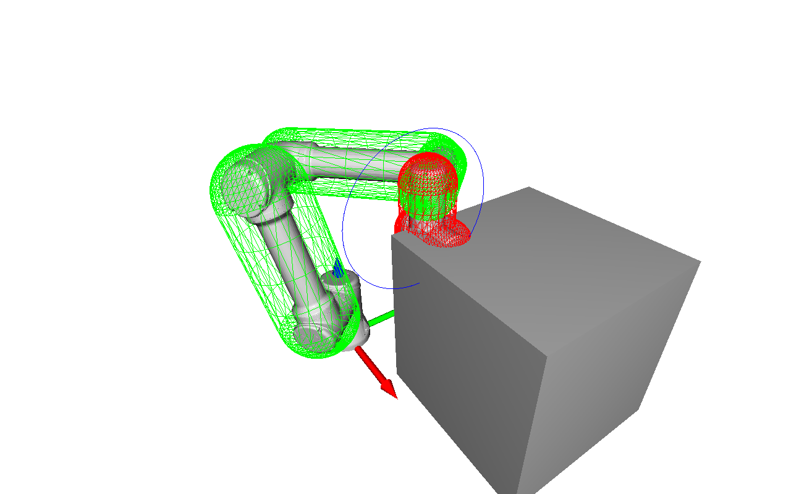

# UR5 Kinematics & Visualization Platform

A lightweight Python platform for **forward/inverse kinematics and joint-space trajectory playback** of a UR5 robot using **Open3D**.  
Designed for kinematic testing, frame alignment, and visualization without ROS.

---



## Requirements

- Python **3.9+**
- Windows / Linux / macOS
- OpenGL-capable GPU (for Open3D viewer)

---

## Setup

### 1. Clone the repository

```bash
git clone <your-repo-url>
cd <your-repo-folder>
```

### 2. Create a virtual environment

**Windows (PowerShell)**

```powershell
python -m venv .venv
.venv\Scripts\Activate.ps1
```

**Windows (CMD)**

```bat
.venv\Scripts\activate.bat
```

**Linux / macOS**

```bash
python3 -m venv .venv
source .venv/bin/activate
```

---

### 3. Install dependencies

```bash
pip install --upgrade pip
pip install -r requirements.txt
```

If you don’t have `requirements.txt`, install manually:

```bash
pip install open3d numpy
```

---

## Trajectory Format

Create or edit `trajectory.json` in the project root:

```json
{
  "units": "deg",
  "waypoints": [
    { "t": 0.0, "q": [0, 0, 0, 0, 0, 0] },
    { "t": 1.0, "q": [20, -10, 30, 0, 10, 0] },
    { "t": 2.0, "q": [45, -30, 60, -45, 30, 10] }
  ]
}
```

### Fields

- `t` → timestamp in seconds
- `q` → joint angles `[q1, q2, q3, q4, q5, q6]`
- Playback **loops automatically**
- Linear interpolation between waypoints

---

## Run the Viewer

```bash
python main.py
```

This will:

- Load UR5 STL meshes from `model/`
- Open a 3D visualization window
- Play the trajectory in a loop
- Display world and joint coordinate frames

---

## Project Structure

```
.
├── model/
│   ├── base_mount_fixed.stl
│   ├── base_joint_fixed.stl
│   ├── shoulder_joint_fixed.stl
│   ├── elbow_joint_fixed.stl
│   ├── forearm_joint_fixed.stl
│   ├── wrist_joint_fixed.stl
│   └── end_effector_joint_fixed.stl
│
├── main.py                 # Entry point
├── robot.py               # UR5 model, joints, FK/IK
├── viewer.py             # Open3D visualization wrapper
├── trajectory.py        # JSON waypoint player
├── trajectory.json      # Motion definition
├── requirements.txt
└── utils/
    └── transformation_helper.py
```

---

## Kinematics Model

The robot uses a custom forward kinematics chain:

\[
T^{world}_{ee} =
T^{world}_{base}
T^{base}_{shoulder}
T^{shoulder}_{elbow}
T^{elbow}_{forearm}
T^{forearm}_{wrist}
T^{wrist}\_{ee}
\]

Each link pose is represented by a homogeneous transform:

\[
T =
\begin{bmatrix}
R & t \\
0 & 1
\end{bmatrix}
\]

Joint frames and meshes are updated using **delta transforms**:

\[
T*{\Delta} = T*{new} \cdot T\_{old}^{-1}
\]

This avoids recreating geometry and keeps Open3D updates fast and stable.

---

## Inverse Kinematics

Inverse kinematics is solved numerically using **Damped Least Squares (DLS)**:

\[
\Delta q = (J^T J + \lambda^2 I)^{-1} J^T e
\]

Where:

- \(J\) is the geometric Jacobian
- \(e\) is the pose error (position + orientation)
- \(\lambda\) is a damping factor for stability near singularities

Supports:

- Joint limits
- Orientation + position control
- Smooth convergence

---

## Units

- Joint angles: **Degrees** (default)
- Mesh translation: **Millimeters**
- Internally converted to radians where required for trigonometric functions

To use radians, set:

```json
"units": "rad"
```

in `trajectory.json`.

---

## Development Notes

This project is intended for:

- Kinematic debugging
- Frame alignment
- Trajectory testing
- Visual IK validation
- Robotics coursework and research

It intentionally avoids:

- ROS / ROS2
- Physics simulation
- URDF dependencies

---

## Future Extensions

- 🎯 Interactive IK target frame
- 🎮 Slider UI for live joint control
- 🧩 Collision checking
- 📡 Network joint streaming
- 📤 URDF export

---

## License

MIT — use it, break it, fix it, improve it.
